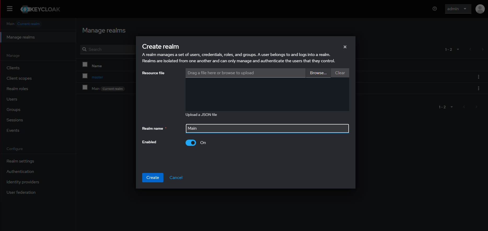
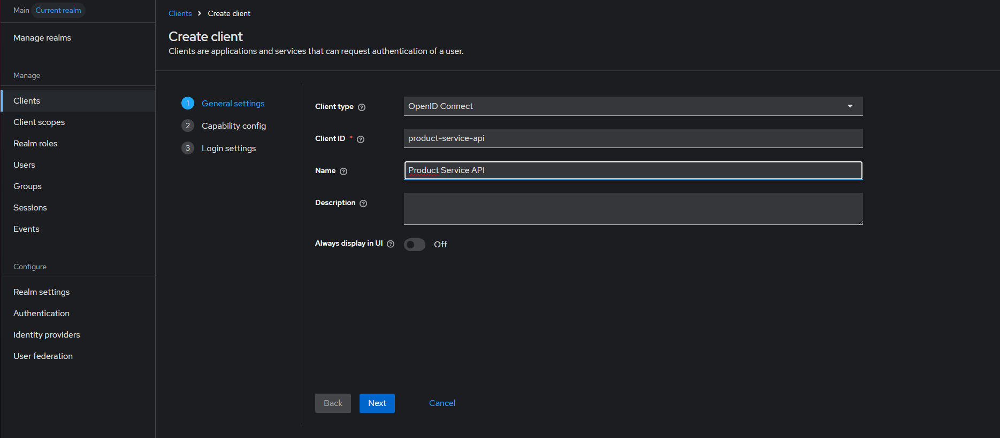
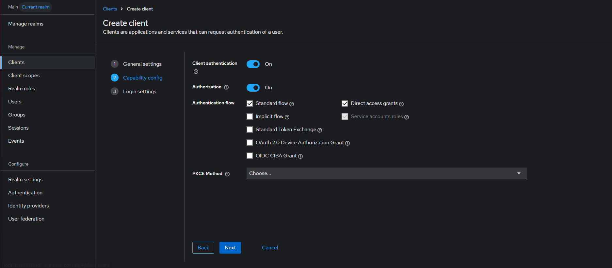
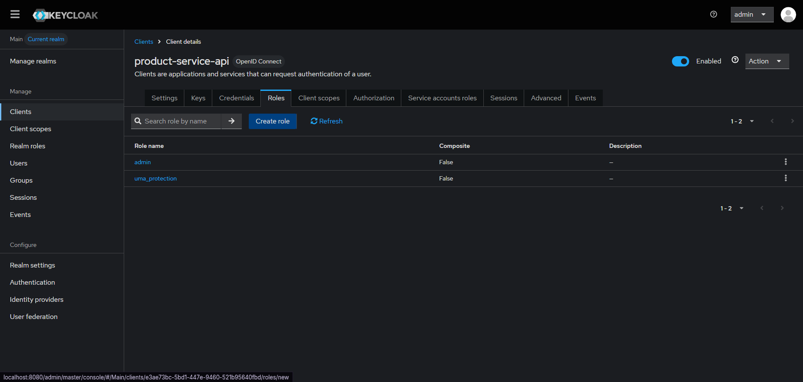
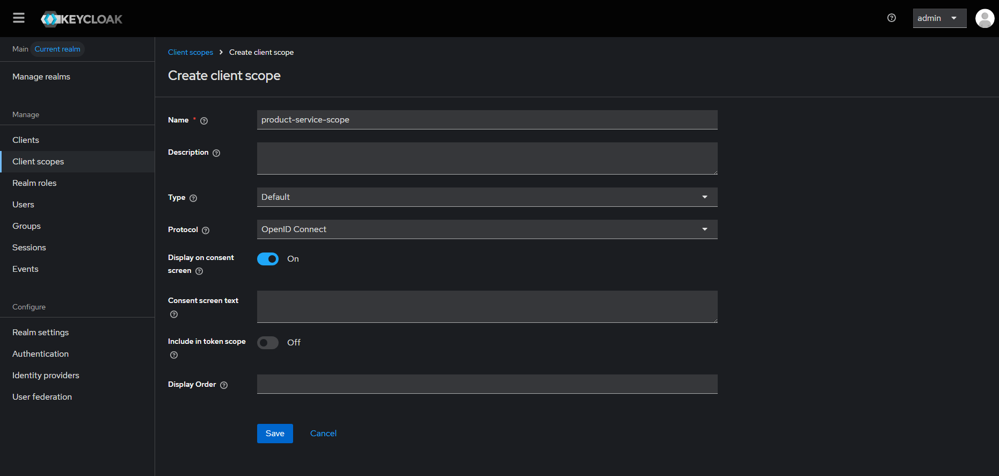
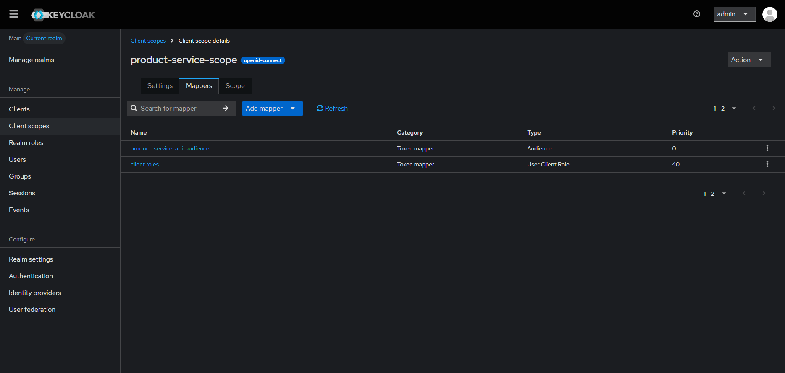
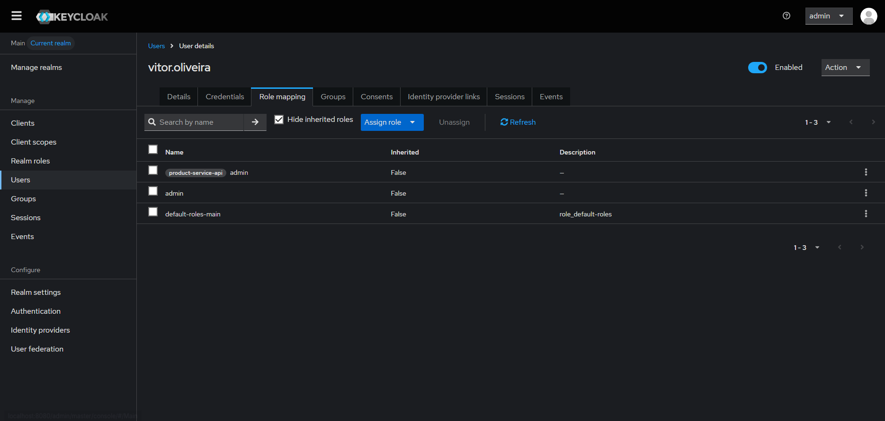

# Product Service API

---

REST API for product management built with ASP.NET Core 8, Entity Framework Core, SQL Server, and Keycloak.

## Features

- Product CRUD operations
- Entity Framework Core migrations
- SQL Server integration
- Swagger/OpenAPI documentation
- Repository & Service pattern
- Global exception handling
- JWT Authentication with Keycloak
- Role-Based Access Control (RBAC)
- Environment variable configuration


## Technologies


- ASP.NET Core 8
- Entity Framework Core
- SQL Server 2022
- Keycloak
- Docker
- Swagger / OpenAPI


## Requirements


- .NET 8 SDK
- SQL Server 2022
- Keycloak
- Docker (recommended)


## Local Development Setup

---

### Start Infrastructure

```bash
docker compose up -d
```

Verify containers:

```bash
docker ps
```

Expected containers:

```text
sqlserver2022
keycloak
```

## Docker Services

### SQL Server

| Property | Value |
|-----------|---------|
| Port | 1433 |
| Engine | SQL Server 2022 |

### Keycloak

| Property | Value |
|-----------|---------|
| URL | http://localhost:8080 |
| Admin User | admin |
| Admin Password | admin123 |

---

The application requires the following environment variable:

| Variable | Description |
|-----------|-------------|
| `ConnectionStrings__DefaultConnection` | SQL Server connection string |

### Example

```text
ConnectionStrings__DefaultConnection=Server=localhost,1433;Database={DATABASE_NAME};User Id=sa;Password={YOUR_PASSWORD};TrustServerCertificate=True;
```

## Database Migrations

Create a new migration:

```bash
dotnet ef migrations add MigrationName
```

Apply migrations:

```bash
dotnet ef database update
```

## Running the Application

Restore packages:

```bash
dotnet restore
```

Apply migrations:

```bash
dotnet ef database update
```

Run:

```bash
dotnet run
```

Swagger:

```text
http://localhost:{PORT}/swagger
```

## Authentication & Authorization

---

Authentication and authorization are handled through Keycloak using JWT Bearer tokens.

The API supports Role-Based Access Control (RBAC) using Keycloak client roles.

### Keycloak Setup

#### 1. Create a Realm

Create a new realm:

```text
Main
```


## Architecture


#### 2. Create a Client

Example:

```text
product-service-api
```



Recommended settings:

- Client Authentication: ON
- Authorization: ON
- Direct access grants: ON



#### 3. Create Client Roles

Example roles:

```text
admin
```



#### 4. Create a Client Scope

Example:

```text
product-service-scope
```



#### 5. Configure Role Mappers

Inside the Client Scope, add:

##### Client Roles Mapper

Include client roles in the generated access token.

##### Audience Mapper

Add the API client as audience.

Example audience:

```text
product-service-api-audience
```



#### 6. Assign the Scope to the Client

Add the created Client Scope to the client.

#### 7. Assign Roles to Users

Assign the desired client roles to the user.

Example:

```text
admin or user
```



### Token Example

After authentication, the access token will contain:

```json
...
"realm_access": {
"roles": [
"offline_access",
"uma_authorization",
"default-roles-main"
]
},
"resource_access": {
"product-service-api": {
"roles": [
"admin"  <----------------------
]
},
"account": {
"roles": [
"manage-account",
"manage-account-links",
"view-profile"
]
}
},
"scope": "email profile",
"email_verified": false,
"name": "{NAME}",
"preferred_username": "{USERNAME}",
"given_name": "{NAME}",
"family_name": "{SURNAME}",
"email": "{EMAIL}"
}
```

### API Authorization

Endpoints can be protected using roles.

Example:

```csharp
Program.cs

.AddPolicy(
        "Policy",
        policy => policy.RequireResourceRoles("admin"));
```

## Project Structure

```text
product-service-api
├── Controllers
├── Data
├── DTO
├── Exceptions
├── Middleware
├── Mapping
├── Migrations
├── Model
├── Repository
├── Service
├── Program.cs
└── appsettings.json
```